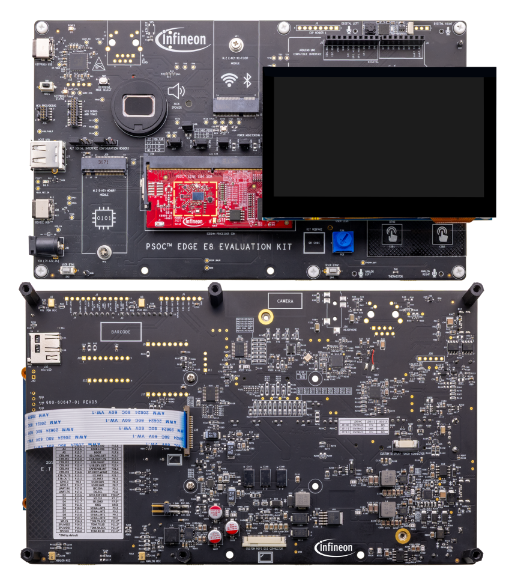
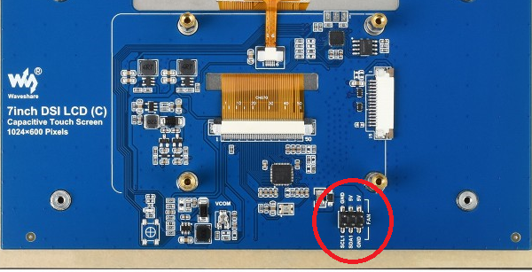
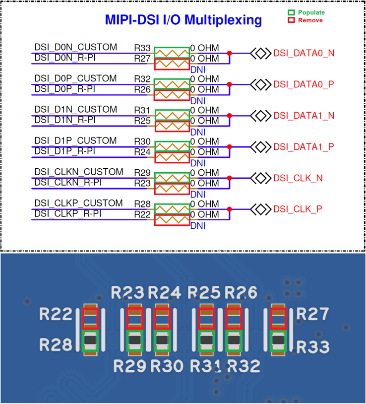
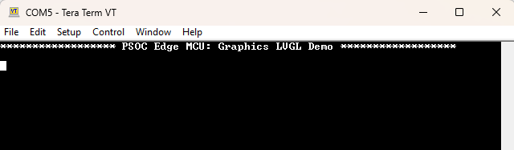
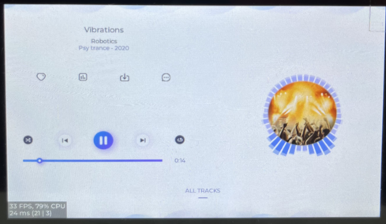

# PSOC&trade; Edge MCU: Graphics LVGL demo

This code example demonstrates how to render a 2D graphics demo using the Light and Versatile Graphics Library (LVGL) on the PSOC&trade; Edge MCU with the following supported displays.

- Waveshare 4.3-inch Raspberry Pi DSI 800x480 pixel display
- Waveshare 7-inch Raspberry Pi DSI LCD C 1024x600 pixel display
- 10.1 inch 1024x600 TFT display (WF101JTYAHMNB0)

The 2D graphics showcase a music player application, which is featured as one of the standard demos on the LVGL page. The LCD is connected through the MIPI Display Serial Interface (DSI), and the code is designed to operate in a FreeRTOS environment.

This code example has a three project structure: CM33 secure, CM33 non-secure, and CM55 projects. All three projects are programmed to the external QSPI flash and executed in Execute in Place (XIP) mode. Extended boot launches the CM33 secure project from a fixed location in the external flash, which then configures the protection settings and launches the CM33 non-secure application. Additionally, CM33 non-secure application enables CM55 CPU and launches the CM55 application. The CM55 application implements the logic for this code example.

> **Note:** This application builds for the 4.3-inch display by default.

   ```
   CONFIG_DISPLAY=W4P3INCH_DISP
   ```

   To build the application for the 7-inch display, set the following macro in *common.mk*:

   ```
   CONFIG_DISPLAY=WS7P0DSI_RPI_DISP
   ```

   OR

   To build the application for the 10.1-inch display, set the following macro in *common.mk*:

   ```
   CONFIG_DISPLAY=WF101JTYAHMNB0_DISP
   ```

[View this README on GitHub.](https://github.com/Infineon/mtb-example-psoc-edge-gfx-lvgl-demo)

[Provide feedback on this code example.](https://yourvoice.infineon.com/jfe/form/SV_1NTns53sK2yiljn?Q_EED=eyJVbmlxdWUgRG9jIElkIjoiQ0UyMzkyNTkiLCJTcGVjIE51bWJlciI6IjAwMi0zOTI1OSIsIkRvYyBUaXRsZSI6IlBTT0MmdHJhZGU7IEVkZ2UgTUNVOiBHcmFwaGljcyBMVkdMIGRlbW8iLCJyaWQiOiJzYW5qZWV2Lm1hanVtZGFyQGluZmluZW9uLmNvbSIsIkRvYyB2ZXJzaW9uIjoiMi40LjAiLCJEb2MgTGFuZ3VhZ2UiOiJFbmdsaXNoIiwiRG9jIERpdmlzaW9uIjoiTUNEIiwiRG9jIEJVIjoiSUNXIiwiRG9jIEZhbWlseSI6IlBTT0MifQ==)

See [Design and implementation](docs/design_and_implementation.md) for the functional description of this code example.


## Requirements

- [ModusToolbox&trade;](https://www.infineon.com/modustoolbox) v3.7 or later (tested with v3.7)
- Board support package (BSP) minimum required version: 1.0.0
- Programming language: C
- Associated parts: All [PSOC&trade; Edge MCU](https://www.infineon.com/products/microcontroller/32-bit-psoc-arm-cortex/32-bit-psoc-edge-arm) parts


## Supported toolchains (make variable 'TOOLCHAIN')

- GNU Arm&reg; Embedded Compiler v14.2.1 (`GCC_ARM`) – Default value of `TOOLCHAIN`
- Arm&reg; Compiler v6.22 (`ARM`)
- IAR C/C++ Compiler v9.50.2 (`IAR`)
- LLVM Embedded Toolchain for Arm&reg; v19.1.5 (`LLVM_ARM`)


## Supported kits (make variable 'TARGET')

- [PSOC&trade; Edge E84 Evaluation Kit](https://www.infineon.com/KIT_PSE84_EVAL) (`KIT_PSE84_EVAL_EPC2`) – Default value of `TARGET`
- [PSOC&trade; Edge E84 Evaluation Kit](https://www.infineon.com/KIT_PSE84_EVAL) (`KIT_PSE84_EVAL_EPC4`)
- [PSOC&trade; Edge E84 AI Kit](https://www.infineon.com/KIT_PSE84_AI) (`KIT_PSE84_AI`)


## Hardware setup

This example uses the board's default configuration. See the kit user guide to ensure that the board is configured correctly.

Ensure the following jumper and pin configurations on board:
- BOOT SW must be in the HIGH/ON position
- J20 and J21 must be in the tristate/not connected (NC) position for the PSOC&trade; Edge E84 Evaluation Kit

> **Note:** This hardware setup is not required for KIT_PSE84_AI.

### Supported display and electrical connection
1. **Waveshare 4.3 inch Raspberry Pi DSI 800*480 pixel display:** This display is supported by default <br>

   Connect the FPC 15-pin cable between the display connector and the PSOC&trade; Edge E84 kit's RPi MIPI DSI connector as shown in **Figure 1** <br>

   **Table 1. Cable connection between display connector and kit**

   Kit name                                      | DSI connector
   ----------------------------------------------- | --------------
   PSOC&trade; Edge E84 Evaluation Kit             | J39
   PSOC&trade; Edge E84 AI Kit                     | J10

   **Figure 1.  Display connection with PSOC&trade; Edge E84 Evaluation Kit**

   

2. **Waveshare 7-inch Raspberry-Pi DSI LCD C 1024*600 pixel display:** <br>

   In this display, few I2C connections are present on the header named `FAN` on display's hardware, it is highlighted in **Figure 2** <br>

   **Figure 2. Waveshare 7-inch Raspberry Pi DSI LCD (C) display's I2C connection (FAN connector)**

   

   Interface the display with the PSOC&trade; Edge E84 kit's using the connections outlined in **Table 2** <br>

   > **Note:** For the PSOC&trade; Edge E84 AI Kit, populate the header at J16

   **Table 2: PSOC&trade; Edge E84 kit's connections**

   Display Connector | PSOC&trade; Edge E84 Evaluation Kit connector | PSOC&trade; Edge E84 AI Kit connector
   ------------------|-----------------------------------------------|----------------------------
   DSI connector     | J39                                           | J10
   GND (FAN)         | GND (J41.1)                                   | GND (J16.3)
   5V  (FAN)         | 5V (J41.3)                                    | 5V (J16.1)
   SCL (FAN)         | I2C_SCL (J41.2)                               | I2C_SCL_3V3 (J16.2)
   SDA (FAN)         | I2C_SDA (J41.4)                               | I2C_SDA_3V3 (J16.4)

<br>

3. **10.1 inch 1024*600 pixel TFT LCD (WF101JTYAHMNB0):** This setup requires rework on the PSOC&trade; Edge E84 Evaluation Kit, and the rework instructions are as follows:

   - **Remove:** R22, R23, R24, R25, R26, R27
   - **Populate:** R28, R29, R30, R31, R32, R33

   **Figure 3. Rework on PSOC&trade; Edge E84 baseboard**

   

   Interface the display with the PSOC&trade; Edge E84 Evaluation Kit using the connections outlined in **Table 3** <br>

   **Table 3: PSOC&trade; Edge E84 Evaluation Kit connections**

   Display Connector | PSOC&trade; Edge E84 Evaluation Kit connector
   --------------------|----------------------------------------
   DSI connector       | J38
   Touch connector     | J37

> **Note:** The PSOC&trade; Edge E84 AI Kit does not support this 10.1 inch 1024*600 pixel TFT LCD (WF101JTYAHMNB0) display.


## Software setup

See the [ModusToolbox&trade; tools package installation guide](https://www.infineon.com/ModusToolboxInstallguide) for information about installing and configuring the tools package.

Install a terminal emulator if you do not have one. Instructions in this document use [Tera Term](https://teratermproject.github.io/index-en.html).

This example requires no additional software or tools.


## Operation

See [Using the code example](docs/using_the_code_example.md) for instructions on creating a project, opening it in various supported IDEs, and performing tasks, such as building, programming, and debugging the application within the respective IDEs.

1. Connect the selected LCD display to the board according to the instructions given in [Display setup](#supported-display-and-electrical-connection-with-kit_pse84_eval) section

2. Connect the board to your PC using the provided USB cable through the KitProg3 USB connector

3. Open a terminal program and select the KitProg3 COM port. Set the serial port parameters to 8N1 and 115200 baud

4. In the common makefile - _<application\>/common.mk_, add one of the following set of values in the **variable** `CONFIG_DISPLAY` to enable display and its corresponding touch driver compilation for the selected display panel. The same information is mentioned in comments in the common makefile

   - **Waveshare 4.3-inch Raspberry-Pi DSI LCD and its touch panel (FT5406):** `W4P3INCH_DISP` <br> This is enabled by default

   - **Waveshare 7 inch Raspberry Pi DSI LCD (C) Display (DISP_WS7P0DSI_RPI) and its touch panel (GT911):** `WS7P0DSI_RPI_DISP`

   - **10.1 inch 1024*600 TFT LCD (WF101JTYAHMNB0) and its touch panel (ILI2511):** `WF101JTYAHMNB0_DISP`

      > **Note:** From the above set, at a time only one display with its touch driver will be enabled in the _common makefile_

      **Example**:

      To use the Waveshare 7-inch Raspberry Pi DSI LCD (C) display:

      ```
      CONFIG_DISPLAY = WS7P0DSI_RPI_DISP
      ```

      OR

      To use the 10.1 inch WF101JTYAHMNB0 display:

      ```
      CONFIG_DISPLAY = WF101JTYAHMNB0_DISP
      ```

5. Build and program the application

6. After programming, the application starts automatically. Confirm that "PSOC Edge MCU: Graphics LVGL Demo" is displayed on the UART terminal

   **Figure 4. Terminal output on program startup**

   

7. Observe that the LCD displays a music player demo application. You can use the touch screen to perform various actions, such as playing or pausing a track, switching to the next or previous track, and viewing the playlist

   **Figure 5. LVGL demo**

   

   **Figure 6. LVGL music player**

   

8. To display CPU usage on the screen, enable the following macro in lv_conf.h:

      ```
      #define LV_USE_SYSMON 1
      ```

   The on-screen position of the CPU usage indicator is determined by the macro:

      ```
      #define LV_USE_PERF_MONITOR_POS LV_ALIGN_BOTTOM_LEFT
      ```

   **Figure 7. LVGL music player with CPU usage**

   

9. For testing the code example with other supported display, repeat the above steps. At **Step 4**, enable the display of your choice and then follow the remaining steps


## Related resources

Resources  | Links
-----------|----------------------------------
Application notes  | [AN235935](https://www.infineon.com/AN235935) – Getting started with PSOC&trade; Edge E8 MCU on ModusToolbox&trade; software <br> [AN239191](https://www.infineon.com/AN239191) – Getting started with graphics on PSOC&trade; Edge MCU
Code examples  | [Using ModusToolbox&trade;](https://github.com/Infineon/Code-Examples-for-ModusToolbox-Software) on GitHub
Device documentation | [PSOC&trade; Edge MCU datasheets](https://www.infineon.com/products/microcontroller/32-bit-psoc-arm-cortex/32-bit-psoc-edge-arm#documents) <br> [PSOC&trade; Edge MCU reference manuals](https://www.infineon.com/products/microcontroller/32-bit-psoc-arm-cortex/32-bit-psoc-edge-arm#documents)
Development kits | Select your kits from the [Evaluation board finder](https://www.infineon.com/cms/en/design-support/finder-selection-tools/product-finder/evaluation-board)
Libraries  | [mtb-dsl-pse8xxgp](https://github.com/Infineon/mtb-dsl-pse8xxgp) – Device support library for PSE8XXGP <br> [retarget-io](https://github.com/Infineon/retarget-io) – Utility library to retarget STDIO messages to a UART port
Tools  | [ModusToolbox&trade;](https://www.infineon.com/modustoolbox) – ModusToolbox&trade; software is a collection of easy-to-use libraries and tools enabling rapid development with Infineon MCUs for applications ranging from wireless and cloud-connected systems, edge AI/ML, embedded sense and control, to wired USB connectivity using PSOC&trade; Industrial/IoT MCUs, AIROC&trade; Wi-Fi and Bluetooth&reg; connectivity devices, XMC&trade; Industrial MCUs, and EZ-USB&trade;/EZ-PD&trade; wired connectivity controllers. ModusToolbox&trade; incorporates a comprehensive set of BSPs, HAL, libraries, configuration tools, and provides support for industry-standard IDEs to fast-track your embedded application development

<br>


## Other resources

Infineon provides a wealth of data at [www.infineon.com](https://www.infineon.com) to help you select the right device, and quickly and effectively integrate it into your design.


## Document history

Document title: *CE239259* - *PSOC&trade; Edge MCU: Graphics LVGL demo*

 Version | Description of change
 ------- | ---------------------
 1.x.0   | New code example <br> Early access release
 2.0.0   | GitHub release
 2.1.0   | Added KIT_PSE84_AI BSP support
 2.2.0   | Patched alpha-premultiplied images assets for widgets demo <br> Provided fix to use target display's actual resolution
 2.3.0   | Updated design files to fix ModusToolbox&trade; v3.7 build warnings
 2.4.0   | Improved widget demo performance when benchmarking is enabled <br> Fixed a GPU hanging issue in the widget demo when benchmark is enabled
<br>


All referenced product or service names and trademarks are the property of their respective owners.

The Bluetooth&reg; word mark and logos are registered trademarks owned by Bluetooth SIG, Inc., and any use of such marks by Infineon is under license.

PSOC&trade;, formerly known as PSoC&trade;, is a trademark of Infineon Technologies. Any references to PSoC&trade; in this document or others shall be deemed to refer to PSOC&trade;.

---------------------------------------------------------

(c) 2025, Infineon Technologies AG, or an affiliate of Infineon Technologies AG. All rights reserved.
This software, associated documentation and materials ("Software") is owned by Infineon Technologies AG or one of its affiliates ("Infineon") and is protected by and subject to worldwide patent protection, worldwide copyright laws, and international treaty provisions. Therefore, you may use this Software only as provided in the license agreement accompanying the software package from which you obtained this Software. If no license agreement applies, then any use, reproduction, modification, translation, or compilation of this Software is prohibited without the express written permission of Infineon.
<br>
Disclaimer: UNLESS OTHERWISE EXPRESSLY AGREED WITH INFINEON, THIS SOFTWARE IS PROVIDED AS-IS, WITH NO WARRANTY OF ANY KIND, EXPRESS OR IMPLIED, INCLUDING, BUT NOT LIMITED TO, ALL WARRANTIES OF NON-INFRINGEMENT OF THIRD-PARTY RIGHTS AND IMPLIED WARRANTIES SUCH AS WARRANTIES OF FITNESS FOR A SPECIFIC USE/PURPOSE OR MERCHANTABILITY. Infineon reserves the right to make changes to the Software without notice. You are responsible for properly designing, programming, and testing the functionality and safety of your intended application of the Software, as well as complying with any legal requirements related to its use. Infineon does not guarantee that the Software will be free from intrusion, data theft or loss, or other breaches (“Security Breaches”), and Infineon shall have no liability arising out of any Security Breaches. Unless otherwise explicitly approved by Infineon, the Software may not be used in any application where a failure of the Product or any consequences of the use thereof can reasonably be expected to result in personal injury.
